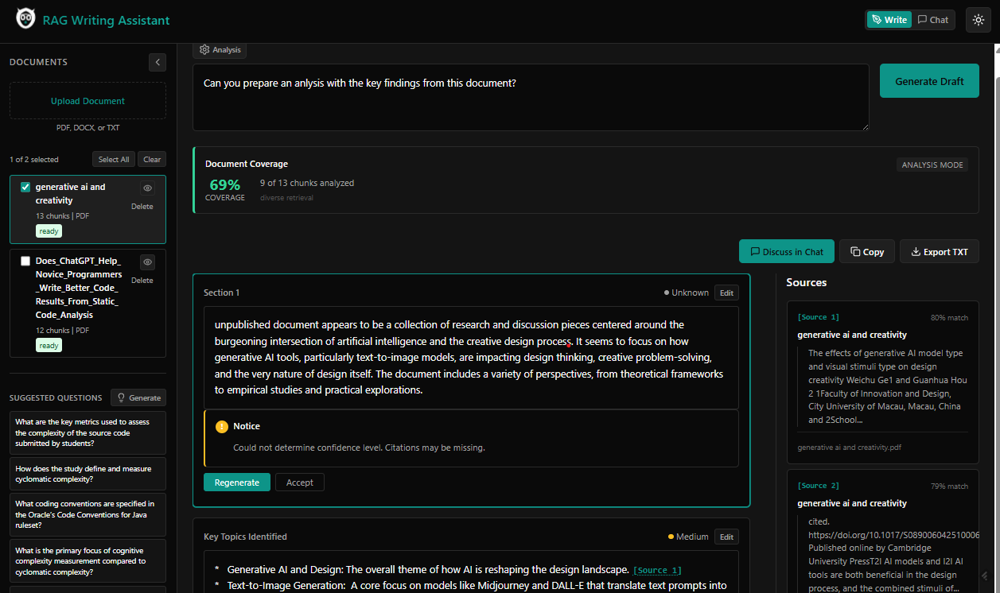

# RAG Document Intelligence


-black)

A transparent AI writing assistant that grounds every claim in your documents. Hover any citation to preview the source, click to verify the full context — so you always know exactly where the AI got its information.



## Features

- **Document upload** - PDF, DOCX, and TXT with drag-and-drop (non-blocking processing)
- **Grounded generation** - All AI content derived from your uploaded documents
- **Interactive citations** - Hover to preview source, click to navigate to full context
- **Confidence indicators** - Visual cues for high/medium/low confidence content
- **Section-level editing** - Regenerate or manually edit individual sections
- **Coverage transparency** - See what % of your documents were analyzed
- **Intent detection** - Auto-selects retrieval strategy per query type (analysis/QA/writing)
- **Chat mode** - Multi-turn conversations with persistent history
- **Dark mode** - Toggle between light and dark themes
- **Keyboard shortcuts** - Ctrl+Enter to generate, Escape to close modals
- **Fully local** - Documents never leave your machine (runs on Ollama)

## Requirements

- Python 3.11+
- Node.js 18+
- [Ollama](https://ollama.ai/) running locally

## Installation

### 1. Install Ollama and pull models

```bash
ollama pull qwen2.5:7b-instruct-q4_0
ollama pull mxbai-embed-large
```

### 2. Set up the backend

```bash
cd backend
pip install -r requirements.txt
```

### 3. Set up the frontend

```bash
cd frontend
npm install
```

## Running the App

Start both services in separate terminals:

```bash
# Terminal 1 - Backend
cd backend
uvicorn app.main:app --reload

# Terminal 2 - Frontend
cd frontend
npm run dev
```

Open http://localhost:5173 in your browser.

## Configuration

Create `backend/.env` to customize (all optional):

```env
# LLM Models (must be available in Ollama)
GENERATION_MODEL=qwen2.5:7b-instruct-q4_0
EMBEDDING_MODEL=mxbai-embed-large

# Intent-specific models (falls back to GENERATION_MODEL)
ANALYSIS_MODEL=llama3.1:8b-instruct-q8_0
WRITING_MODEL=qwen2.5:7b-instruct-q4_0
QA_MODEL=gemma3:4b

# Retrieval settings
SIMILARITY_THRESHOLD=0.35
TOP_K=10

# Coverage settings (for analysis/summary mode)
DEFAULT_COVERAGE_PCT=35
MAX_COVERAGE_PCT=60

# Ollama connection
OLLAMA_BASE_URL=http://localhost:11434
```

## How It Works

### Intent Detection

The system classifies queries and adjusts retrieval strategy automatically:

| Query Example | Intent | Retrieval | Coverage |
|---|---|---|---|
| "Summarize this document" | Analysis | Diverse (regions) | ~35% |
| "What is data feminism?" | Q&A | Similarity (top-k) | ~8-10% |
| "Write a report on X" | Writing | Similarity (top-k) | ~8-10% |

### Coverage Tracking

The UI shows how much of your documents the system actually read:

- Coverage percentage with color indicator (green/yellow/red)
- Chunks analyzed vs total
- "Expand to ~50%" button for deeper analysis

A summary based on 8% is different from 35% — the system makes this visible.

### Confidence Levels

| Level | Criteria |
|---|---|
| High | 3+ citations |
| Medium | 1-2 citations |
| Low | Hedging language detected |
| Unknown | 0 citations |

### Blind Spot Detection

The system reports what it didn't see — documents with no coverage, regions (intro/middle/conclusion) that weren't sampled.

### No Learning From Your Data

RAG does **not** train on your documents. Files are chunked and indexed for retrieval only — the AI model is never modified. Deleting a document removes it completely.

## Chat Mode

Switch to Chat mode for multi-turn conversations about your documents:

- Follow-up questions that build on prior context
- Conversation history in the sidebar (browse, resume, delete)
- Per-message sources showing which chunks were used
- Cumulative coverage tracking across a conversation
- Stored locally as JSON files, never sent externally

## Project Structure

```
rag_writing_assistant/
├── backend/
│   ├── app/
│   │   ├── api/routes/          # FastAPI endpoints
│   │   ├── core/                # Exceptions, logging
│   │   ├── models/              # Pydantic models
│   │   ├── rag/                 # Chunking, embeddings, vector store, prompts
│   │   ├── services/            # Business logic (generation, retrieval, intent)
│   │   ├── config.py            # Settings
│   │   └── main.py              # FastAPI app entry point
│   ├── tests/                   # Pytest test suite
│   ├── data/                    # Document storage, vector indices, conversations
│   ├── requirements.txt
│   └── pyproject.toml
├── frontend/
│   ├── src/
│   │   ├── api/                 # API client
│   │   ├── components/          # React components
│   │   ├── hooks/               # React Query hooks
│   │   ├── types/               # TypeScript interfaces
│   │   └── test/                # Test utilities
│   ├── package.json
│   ├── tsconfig.json
│   └── vite.config.ts
├── docs/                        # Screenshots
├── CLAUDE.md                    # AI agent instructions
├── CHANGELOG.md
└── README.md
```

## API Reference

| Endpoint | Method | Description |
|---|---|---|
| `/api/documents` | POST | Upload document |
| `/api/documents` | GET | List documents |
| `/api/documents/{id}` | GET | Get document status |
| `/api/documents/{id}` | DELETE | Delete document |
| `/api/generate` | POST | Generate draft |
| `/api/generate/section` | POST | Regenerate section |
| `/api/generate/suggestions` | POST | Generate suggested questions |
| `/api/chat` | POST | Send chat message |
| `/api/chat` | GET | List conversations |
| `/api/chat/{id}` | GET | Get conversation |
| `/api/chat/{id}` | DELETE | Delete conversation |
| `/api/chat/{id}` | PATCH | Update conversation title |
| `/api/health` | GET | Health check |

Document uploads are non-blocking — the endpoint returns immediately with `status: "pending"`, then progresses through `processing` to `ready` (or `failed`).

## Development

### Running Tests

```bash
# Backend (pytest)
cd backend && pytest tests/ -v

# Frontend (vitest)
cd frontend && npm run test

# Frontend type check + build
cd frontend && npm run build
```

### Tech Stack

| Layer | Technology |
|---|---|
| Backend | Python 3.11+, FastAPI, Pydantic |
| Frontend | React 18, TypeScript (strict), React Query |
| Vector DB | FAISS (local, file-based) |
| LLM | Ollama (local inference) |
| Embeddings | mxbai-embed-large |

## License

MIT
